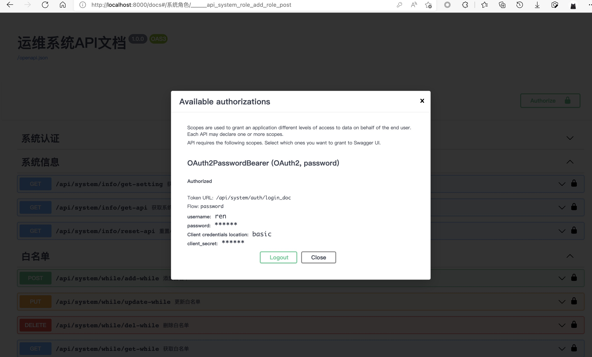
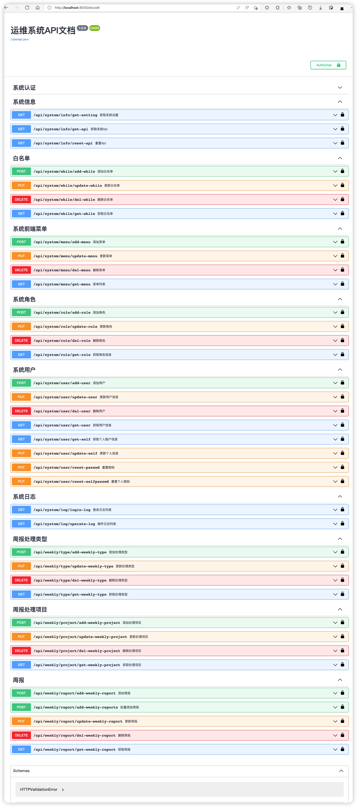
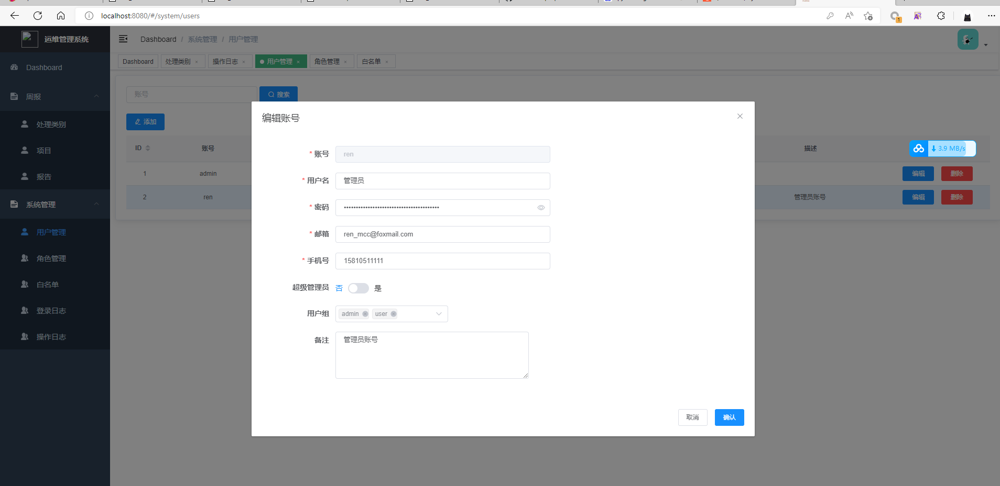
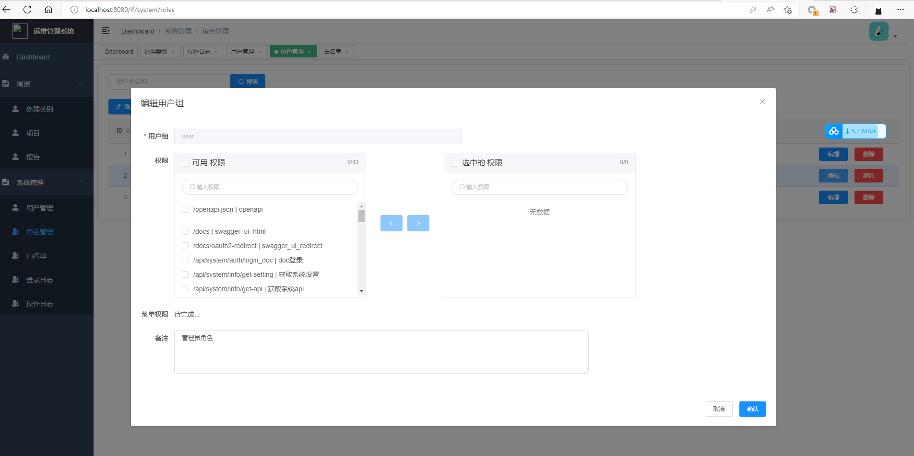
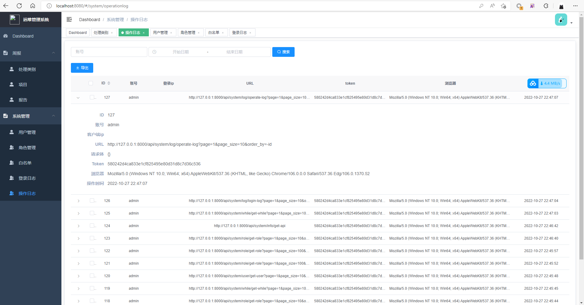
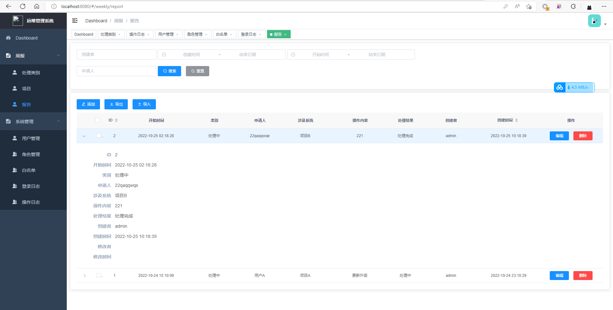

# 运维管理系统
基于fastapi异步框架
## 部署方式
**下载项目**

git clone git@github.com:renmcc/opsapi.git

**创建虚拟环境**

python -m venv venv

**安装依赖库**

pip install -r requirements.txt

**初始化数据库**

alembic init alembic
alembic revision --autogenerate -m "first commit"
alembic upgrade head --sql > update.sql
alembic upgrade head

**添加文档白名单**

文档uri做了ip过滤,需要连接到数据库，write_ip表中添加可访问ip
http://localhost:8000/docs#/

**添加管理员账号**

运行script/generapwd.py生成密码，编辑数据库sys_user表添加一行用户数据，is_supser字段1
之后登陆/docs进行登陆认证，认证通过后，其他接口便有权限操作

# 截图
**登陆认证**

**api**

**UI**

